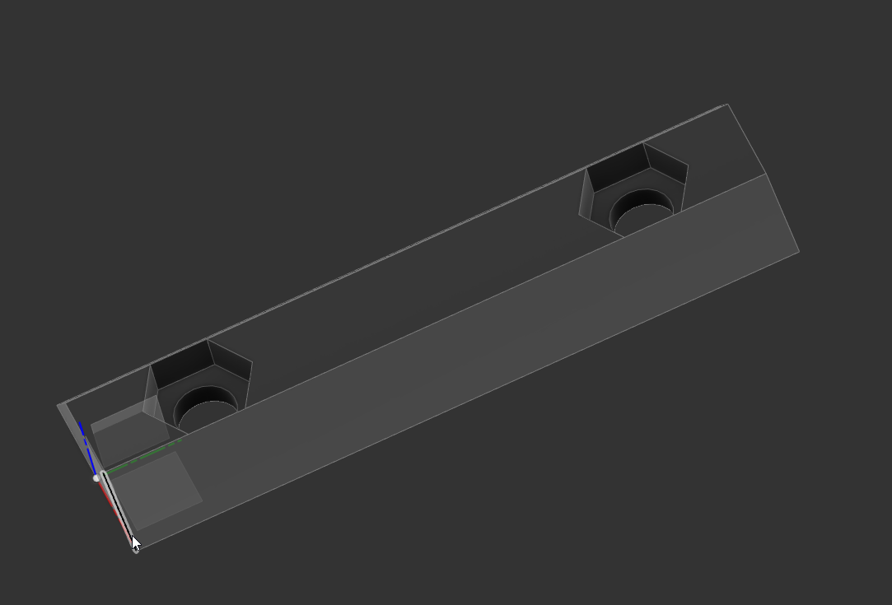

# CR6 Linear Rail Hotend adapter

Project under development!

I'm working on some adapters that might make is easy to mount the stock hot end onto linear rail using an MGN12H carriage.  Mounting the rail on the front of the x-axis does move the hot end several mm further toward the front of the machine, which might impact build area, not sure yet.
Development purchases:

- MGN12H linear rail from amazon: https://smile.amazon.com/gp/product/B081Q4FHBW

- 2020 v-rail extrusion with 4-slots: https://www.ebay.com/itm/2020-V-Channel-Aluminum-Profile-Extrusion-Anodized-several-sizes-2-pcs/133322634367

I purchased a 400mm section and assume by the time this is functional, it'll probably get cut down and replace the X-axis extrusion on the machine.  I'll probably leave it longer than stock so I don't have to run the 350mm linear rail.

- 20T GT2 pulleys (haven't used yet) - https://smile.amazon.com/gp/product/B07JNQQKTC/

# Parts

- "cr6 mgn12h adapter" - screws onto the mgn12h carriage with m3x6mm flat head cap screws, then backplate bolts on using M5x10mm button head cap screws with an M5 nut captured into the adapter using the mini-v wheel mounting holes
- "rail nut m3" - m3 captured nut fits extrusion slot, 25mm spacing on screw holes should allow you to lightly attach to rail with M3x8mm button head or socket head cap screws and slide into extrusion, then tighten.
- "vrail spacer m3" - haven't used yet but thought it might help keep the linear rail from dropping into the vrail slot if it's misaligned or if your rail is too large

# TO DO: 
 
- need to add some kind of feature for holding the x-axis belt.  Have several ideas from Thingiverse to reference
- design some quick mounts to attach the 20T pulleys to the end of the rail on my desk to replicate motor mounting and tensioner for testing

# Changelog

2021/04/054 - Initial commit

## Design

Autocad Fusion 360 

## Slicer

Ultimaker Cura 4.8.0
- Printer: Creality CR6 SE
- Layer Height: 0.2mm
- Infill Density: 50%
- Infill Pattern: Grid
- Filament: Inland PLA+ 1.75mm Blue
- Material: PLA+
- Print Temperature: 215 degrees C

# Preview

